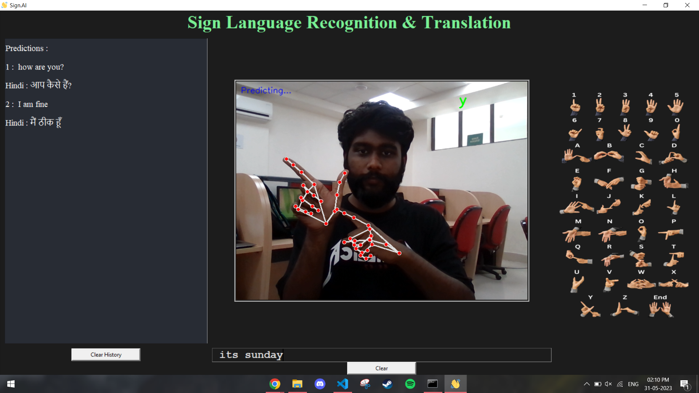

# SIGN.AI:  Sign Language Recognition and Translation </a>
<br />
<p align="center">
  
  <br />
  <br /></p><hr>
Sign.AI is a Sign Language Recognition and Translation application built on top of MediaPipe Framework and it uses ComputerVision to Detect Hand Signs from a user's video capture device. SignAI is accurate and also has the capability to autocorrect words and phrase sentences using GingerIT. Sign.AI also provides Hindi Translation for predictions with the help of argostranslate.

### Features:
* Real-time hand detection and tracking using MediaPipe.
* Hand gesture recognition using a trained TensorFlow model.
* Graphical user interface for visualizing hand detection and recognized gestures.
* Sentence framing using NLP
* Translated predictions in Hindi and English

## Requirements and Installation
### HARDWARE REQUIREMENTS:  

• System Processor: Core i3  
• Hard Disk: 50GB 
• Ram: 8 GB  

### SOFTWARE REQUIREMENTS:  

• Operating system: Windows 10  
• Coding Language: Python  
• Platform: Jupiter Notebook, Pycharm IDE, VSCode

``` 
conda env create -f environment.yml
conda activate project1
python app.py
```
## Structure:
```bash    
SignAI
├── functions
│   └── functions.py
├── images
│   ├── logo.png
│   ├── signs.png
│   ├── signstpb.png
│   └── signstpw.png
├── model
│   ├── keypoint_classifier
│   │   ├── keypoint.csv
│   │   ├── keypoint_classifier.hdf5
│   │   ├── keypoint_classifier.py
│   │   ├── keypoint_classifier.tflite
│   │   └── keypoint_classifier_label.csv
│   └── __init__.py
├── SignAI Project Report.pdf
├── app.py
├── environment.yml
├── keypoint_classification.ipynb
├── requirements.txt
├── docs
│   ├── GUI.png
│   ├── logo.png
│   ├── logo2.png
│   ├── signs.png
│   ├── signstpb.png
│   └── signstpw.png
├── LICENSE
└── README.md
```
## GUI:

<p align="center">
  
  <br />
  <br /></p>

# Contact
If you have any questions, suggestions, or feedback, please feel free to contact me at kartik11721@gmail.com <br />
Project Team : Kartik Kumar, Satya Sangram Pattnaik, Deepak, Narendra Tiwari <br /><br />
<a href="https://www.buymeacoffee.com/kartik11721" target="_blank"></a>
